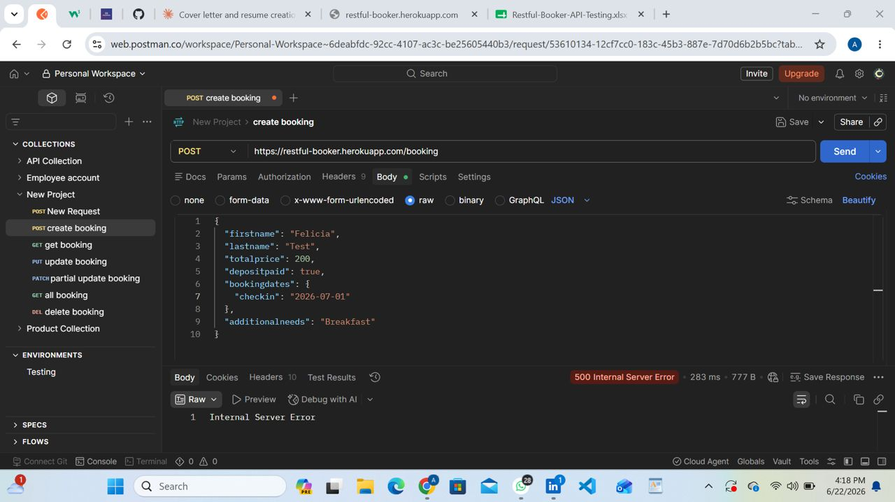

# BUG-001-06: Missing checkout Field Returns 500 Internal Server Error on POST /booking

**Bug ID:** BUG-001-06
**Endpoint:** POST /booking
**Severity:** High
**Priority:** High
**Status:** Open
**Reproducibility:** Intermittent
**Reported By:** Felicia Agbooluchi
**Date:** June 2026

---

## Summary

When the checkout field is omitted from the POST /booking request body, the API returns a 500 Internal Server Error instead of a 400 Bad Request.

---

## Environment

| Component | Details |
|---|---|
| API | Restful-Booker |
| URL | https://restful-booker.herokuapp.com |
| Tool | Postman |
| Browser | Chrome 149.0.7827.115 (64-bit) |
| Device | HP EliteBook 840 G3 |
| Network | WiFi |

---

## Preconditions

API is accessible at https://restful-booker.herokuapp.com

---

## Steps to Reproduce

1. Open Postman
2. Send a POST request to https://restful-booker.herokuapp.com/booking
3. Set Content-Type to application/json
4. Include all required fields in the request body EXCEPT checkout
5. Observe the response

**Request Body:**
```json
{
  "firstname": "Felicia",
  "lastname": "Agbo",
  "totalprice": 200,
  "depositpaid": true,
  "bookingdates": {
    "checkin": "2026-07-01"
  }
}
```

---

## Expected Result

400 Bad Request with a validation error message indicating checkout is required.

---

## Actual Result

500 Internal Server Error. The server crashes instead of returning a validation error.

---

## Evidence



---

## Impact

Bookings can be created without a checkout date. In a production hotel system, this would create open-ended reservations with no departure date.
