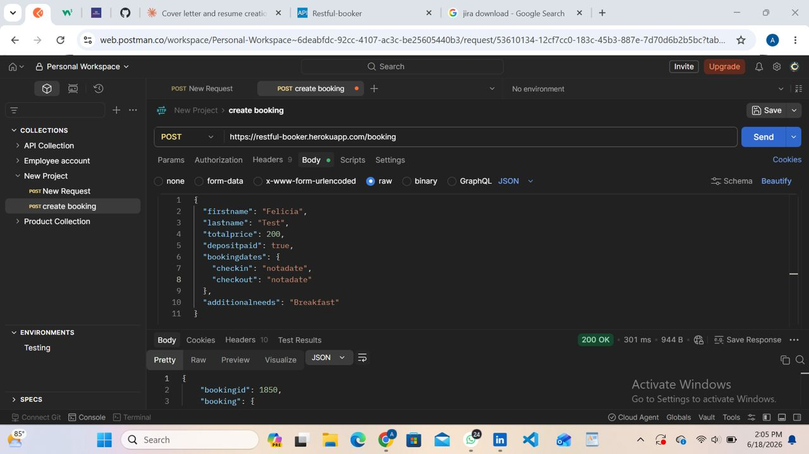

# BUG-003-04: Invalid Date String Accepted as checkout on POST /booking

**Bug ID:** BUG-003-04
**Endpoint:** POST /booking
**Severity:** High
**Priority:** High
**Status:** Open
**Reproducibility:** Always
**Reported By:** Felicia Agbooluchi
**Date:** June 2026

---

## Summary

When checkout is set to an invalid date string such as 'notadate', the API accepts the request and creates a booking. No date format validation is applied.

---

## Environment

| Component | Details |
|---|---|
| API | Restful-Booker |
| URL | https://restful-booker.herokuapp.com |
| Tool | Postman |
| Browser | Chrome 149.0.7827.115 (64-bit) |
| Device | HP EliteBook 840 G3 |
| Network | WiFi |

---

## Preconditions

API is accessible at https://restful-booker.herokuapp.com

---

## Steps to Reproduce

1. Open Postman
2. Send a POST request to https://restful-booker.herokuapp.com/booking
3. Set Content-Type to application/json
4. Set checkout to "notadate"
5. Observe the response

**Request Body:**
```json
{
  "firstname": "Felicia",
  "lastname": "Agbo",
  "totalprice": 200,
  "depositpaid": true,
  "bookingdates": {
    "checkin": "2026-07-01",
    "checkout": "notadate"
  }
}
```

---

## Expected Result

400 Bad Request. Invalid date format should be rejected with a validation error.

---

## Actual Result

200 OK. Booking is created with 'notadate' as the checkout value.

---

## Evidence



---

## Impact

Invalid date values are stored without rejection. This would cause date parsing failures and invalid reservation records in production.
