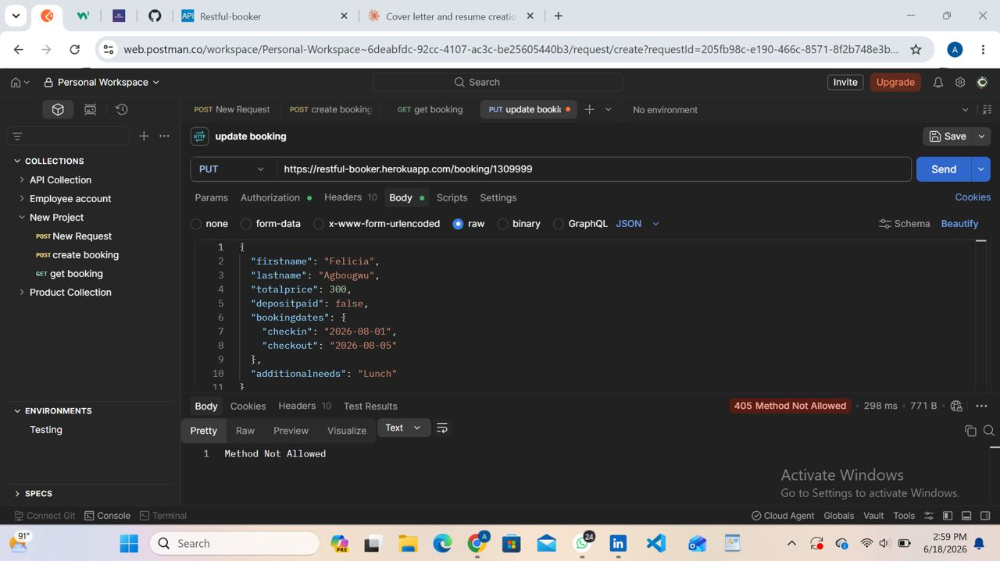

# BUG-004-01: PUT /booking with Non-Existent ID Returns 405 Instead of 404

**Bug ID:** BUG-004-01
**Endpoint:** PUT /booking/{id}
**Severity:** Medium
**Priority:** Medium
**Status:** Open
**Reproducibility:** Always
**Reported By:** Felicia Agbooluchi
**Date:** June 2026

---

## Summary

When a PUT request is sent to update a booking using a non-existent ID with a valid token, the API returns 405 Method Not Allowed instead of 404 Not Found.

---

## Environment

| Component | Details |
|---|---|
| API | Restful-Booker |
| URL | https://restful-booker.herokuapp.com |
| Tool | Postman |
| Browser | Chrome 149.0.7827.115 (64-bit) |
| Device | HP EliteBook 840 G3 |
| Network | WiFi |

---

## Preconditions

API is accessible. Valid auth token generated via POST /auth.

---

## Steps to Reproduce

1. Generate a valid token via POST /auth with username: admin and password: password123
2. Send a PUT request to https://restful-booker.herokuapp.com/booking/1309999
3. Include valid token in the Cookie header as token={token}
4. Include a full valid request body
5. Observe the response

**Request Body:**
```json
{
  "firstname": "Felicia",
  "lastname": "Agbo",
  "totalprice": 200,
  "depositpaid": true,
  "bookingdates": {
    "checkin": "2026-07-01",
    "checkout": "2026-07-05"
  }
}
```

---

## Expected Result

404 Not Found. The API should confirm the booking ID does not exist.

---

## Actual Result

405 Method Not Allowed. The API returns the wrong error code.

---

## Evidence



---

## Impact

Clients cannot distinguish between a non-existent resource and an unsupported operation. This breaks standard REST error handling and makes debugging difficult for API consumers.
